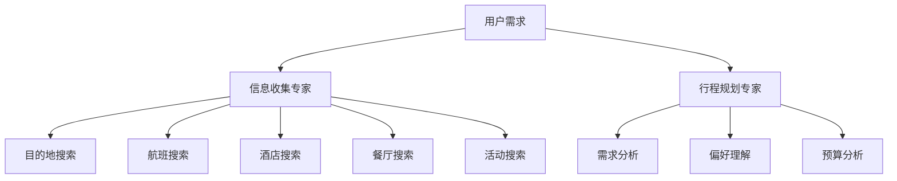

# 双智能体旅行规划团队架构

## 🏗️ 系统架构设计

### 智能体分工策略

#### 🔍 信息收集专家 (Research Agent)
**专业领域**: 数据搜索与信息验证
- **主要职责**:
  - 目的地信息收集（景点、文化、气候）
  - 航班信息搜索和价格比较
  - 酒店和住宿选项调研
  - 餐厅和美食推荐收集
  - 交通信息和路线规划
  - 当地活动和体验项目搜索

- **工具使用**:
  - Google地图搜索API
  - Google航班搜索API
  - Google酒店搜索API
  - Google通用搜索API
  - 时间和日期API

#### 📋 行程规划专家 (Planning Agent)  
**专业领域**: 方案整合与优化规划
- **主要职责**:
  - 用户需求分析和偏好理解
  - 信息整合和数据分析
  - 详细日程安排制定
  - 预算规划和成本控制
  - 行程路线优化
  - 个性化建议和备选方案生成
  - 完整旅行计划文档生成

- **工具使用**:
  - 所有SearchAPI工具（用于验证和补充信息）
  - 逻辑推理和规划能力
  - 预算计算和优化

## 🔄 协作工作流程

### 阶段1: 需求分析
1. **用户输入解析**: 两个智能体同时接收用户需求
2. **任务分解**: 将复杂的旅行规划任务分解为具体子任务

### 阶段2: 并行信息收集


### 阶段3: 信息整合与规划
1. **数据汇总**: 信息收集专家提供原始数据
2. **智能分析**: 行程规划专家分析和处理数据
3. **方案生成**: 基于用户偏好生成个性化方案

### 阶段4: 优化与输出
1. **协作优化**: 两个智能体协作优化方案
2. **质量检查**: 确保信息准确性和方案可行性
3. **最终输出**: 生成完整的旅行计划

## ⚡ 并行处理优势

### 1. 效率提升
- **同时工作**: 两个智能体可以并行处理不同任务
- **专业分工**: 每个智能体专注于自己的专业领域
- **减少等待**: 信息收集和方案规划同步进行

### 2. 质量保证
- **交叉验证**: 两个智能体可以相互验证信息
- **专业深度**: 每个智能体在自己领域更加专业
- **全面覆盖**: 确保旅行计划的各个方面都得到充分考虑

### 3. 灵活扩展
- **模块化设计**: 可以轻松添加新的专业智能体
- **功能解耦**: 不同功能之间相互独立
- **易于维护**: 每个智能体的责任边界清晰

## 🔧 技术实现

### Agent配置
```python
# 信息收集专家
research_agent = Agent(
    tools=[mcp_tools],
    model=model,
    name="旅行信息收集专家",
    goal="专门负责搜索和收集旅行相关数据"
)

# 行程规划专家
planning_agent = Agent(
    tools=[mcp_tools], 
    model=model,
    name="行程规划专家",
    goal="专门负责整合信息和制定旅行方案"
)

# 团队协作
travel_team = Team(
    agents=[research_agent, planning_agent],
    show_chain_of_thought=True
)
```

### 协作机制
- **共享工具**: 两个智能体共享SearchAPI工具集
- **信息传递**: 通过Team框架自动处理智能体间的信息交换
- **思维链展示**: 用户可以看到智能体的协作过程

## 📈 性能优化

### 1. 并发处理
- 信息收集和方案规划可以同时进行
- 减少总体处理时间

### 2. 专业化优势
- 每个智能体专注于自己最擅长的任务
- 提高单个任务的处理质量

### 3. 资源利用
- 更好地利用API调用限额
- 优化模型推理效率

## 🎯 用户体验

### 1. 透明度
- 用户可以看到智能体协作过程
- 了解旅行计划的生成逻辑

### 2. 可靠性
- 双重检查机制提高准确性
- 降低单点故障风险

### 3. 个性化
- 更精准的需求理解
- 更贴合用户偏好的方案生成

## 🚀 未来扩展

### 可能的新智能体
1. **预算优化专家**: 专门负责成本控制和预算优化
2. **风险评估专家**: 专门负责旅行风险评估和保险建议
3. **文档处理专家**: 专门负责签证、文档等行政事务
4. **实时监控专家**: 专门负责行程中的实时信息更新

### 技术改进
1. **智能路由**: 根据任务类型自动选择最适合的智能体
2. **学习机制**: 智能体可以从历史经验中学习改进
3. **动态协作**: 根据任务复杂度动态调整协作策略
